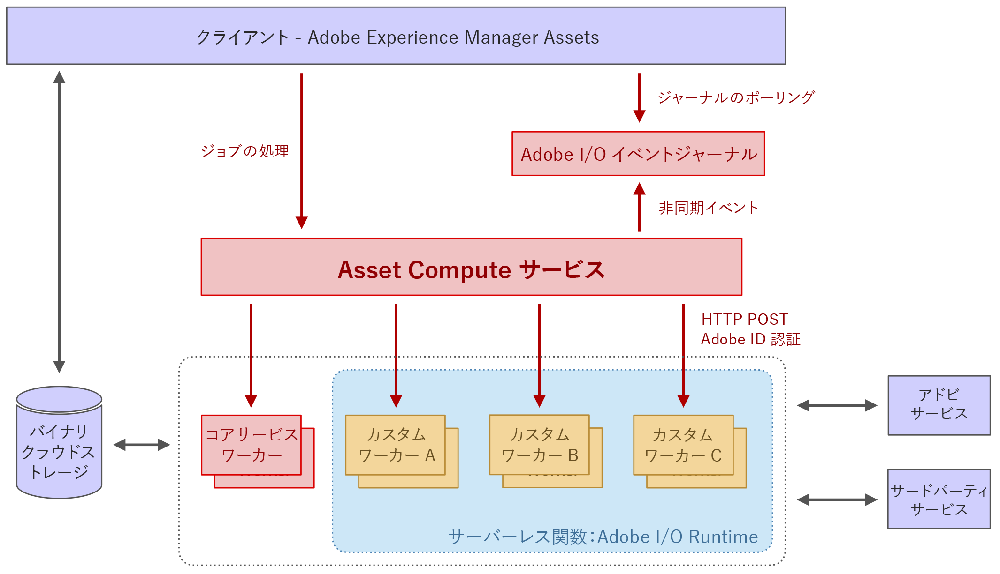

# [!DNL Asset Compute Service] のアーキテクチャ {#overview}

この [!DNL Asset Compute Service] は、サーバーレスAdobeをベースに構築されています [!DNL `I/O Runtime`] プラットフォーム。 アセットに Adobe Sensei コンテンツサービスを提供します。呼び出し側クライアント（Adobe [!DNL Experience Manager] as a [!DNL Cloud Service] のみサポート）には、アセットに必要な Adobe Sensei 生成情報が提供されます。返される情報は JSON 形式です。

[!DNL Asset Compute Service] は、[!DNL Adobe Developer App Builder] に基づいてカスタムアプリケーションを作成することにより拡張できます。これらのカスタムアプリケーションは [!DNL Project Adobe Developer App Builder] ヘッドレスアプリであり、カスタム変換ツールの追加や、画像操作を実行する外部 API の呼び出しなどのタスクをおこないます。

[!DNL Project Adobe Developer App Builder] は、Adobeでカスタム web アプリケーションを構築およびデプロイするためのフレームワークです [!DNL `I/O Runtime`]. カスタムアプリケーションを作成する場合、開発者は以下を利用できます [!DNL React Spectrum] （Adobeの UI ツールキット）、マイクロサービスの作成、カスタムイベントの作成、API の調整をおこないます。 詳しくは、[Adobe Developer App Builder のドキュメント](https://developer.adobe.com/app-builder/docs/overview)を参照してください。

アーキテクチャの基盤となるものは次のとおりです。

* 特定のタスクに必要なものを含むアプリケーションのみのモジュール性により、アプリケーションを相互に切り離し、軽量に保つことができます。

* [!DNL Adobe I/O] Runtime のサーバーレス概念は、非同期性、高いスケーラビリティ、分離、ジョブベースの処理など、多くの利点をもたらし、アセット処理に最適です。

* バイナリクラウドストレージには、ストレージへのフルアクセス権限がなくても、署名済みの URL 参照を使用して、アセットファイルやレンディションを個別に保存およびアクセスするために必要な機能が用意されています。クラウドストレージを使用した転送高速化、CDN キャッシュ、コンピューティングアプリケーションのコロケーションにより、待ち時間が短い最適なコンテンツアクセスが可能になります。AWS クラウドと Azure クラウドの両方がサポートされています。

*図：[!DNL Asset Compute Service] のアーキテクチャと、Adobe [!DNL Experience Manager]、ストレージ、処理アプリケーションとの統合方法。*

アーキテクチャは次の部分で構成されます。

* **API およびオーケストレーションレイヤー**&#x200B;はソースアセットを複数のレンディションに変換するようにサービスに指示する（JSON 形式の）リクエストを受け取ります。リクエストは非同期で、アクティベーション ID （ジョブ ID）で返されます。 命令は純粋に宣言的であり、すべての標準処理作業（サムネールの生成、テキストの抽出など）で、消費者は目的の結果のみを指定し、特定のレンディションを処理するアプリケーションは指定しません。 認証、分析、レート制限などの汎用 API 機能は、サービスの前面にある Adobe API Gateway を使用して処理され、[!DNL Adobe I/O] Runtime に転送されるすべてのリクエストを管理します。アプリケーションルーティングは、オーケストレーションレイヤで動的におこなわれます。クライアントは、特定のレンディション用のカスタムアプリケーションを定義します。これには、独自の一意のパラメーターセットが付属しています。 アプリケーションの実行は、Adobe内で別々のサーバーレス関数なので、完全に並列化できます [!DNL `I/O Runtime`].

* **アセットを処理するアプリケーション** 特定のタイプのファイル形式またはターゲットレンディションに特化したもの。 概念的には、アプリケーションは UNIX® パイプの概念に似ています。入力ファイルは 1 つ以上の出力ファイルに変換されます。

* **A [共通アプリケーションライブラリ](https://github.com/adobe/asset-compute-sdk)** 一般的なタスクを処理します。 例えば、ソースファイルのダウンロード、レンディションのアップロード、エラー報告、イベントの送信、監視などです。 この設計により、アプリケーションの開発がサーバーレスの概念に準拠し、ローカルファイルシステムに限定されたインタラクションで簡単に行えるようになります。

<!-- TBD:

* About the YAML file?
* minimize description to custom applications
* remove all internal stuff (e.g. Photoshop application, API Gateway) from text and diagram
* update diagram to focus on 3rd party custom applications ONLY
* Explain important transactions/handshakes?
* Flow of assets/control? See the illustration on the Nui diagrams wiki.
* Illustrations. See the SVG shared by Alex.
* Exceptions? Limitations? Call-outs? Gotchas?
* Do we want to add what basic processing is not available currently, that is expected by existing AEM customers?
-->
