# カスタムアプリケーションの内部 {#how-custom-application-works}

次の図は、クライアントでカスタムアプリケーションを使用してデジタルアセットを処理する際のエンドツーエンドのワークフローを示しています。



*図：Adobeを使用してアセットを処理する際に必要な手順 [!DNL Asset Compute Service].*

## 登録 {#registration}

クライアントはを呼び出す必要があります [`/register`](api.md#register) に対する最初のリクエストの前に 1 回 [`/process`](api.md#process-request) そのため、Adobeを受け取るためのジャーナル URL を設定して取得できます [!DNL I/O Events] AdobeAsset computeのイベント。

```sh
curl -X POST \
  https://asset-compute.adobe.io/register \
  -H "x-ims-org-id: $ORG_ID" \
  -H "x-gw-ims-org-id: $ORG_ID" \
  -H "Authorization: Bearer $JWT_TOKEN" \
  -H "x-api-key: $API_KEY"
```

[`@adobe/asset-compute-client`](https://github.com/adobe/asset-compute-client#usage) JavaScript ライブラリを NodeJS アプリケーションで使用すると、登録から処理、非同期イベント処理まで、必要なすべての手順を実行できます。必要なヘッダーについて詳しくは、[認証と承認](api.md)を参照してください。

## 処理 {#processing}

クライアントは[処理](api.md#process-request)リクエストを送信します。

```sh
curl -X POST \
  https://asset-compute.adobe.io/process \
  -H "x-ims-org-id: $ORG_ID" \
  -H "x-gw-ims-org-id: $ORG_ID" \
  -H "Authorization: Bearer $JWT_TOKEN" \
  -H "x-api-key: $API_KEY" \
  -d "<RENDITION_JSON>
```

クライアントは、署名済みの URL を使用してレンディションの形式を正しく設定する必要があります。[`@adobe/node-cloud-blobstore-wrapper`](https://github.com/adobe/node-cloud-blobstore-wrapper#presigned-urls) JavaScript ライブラリを NodeJS アプリケーションで使用すると、URL に事前に署名することができます。現在、このライブラリでは Azure Blob ストレージと AWS S3 コンテナのみをサポートしています。

処理リクエストは、[!DNL Adobe I/O] イベントのポーリングに使用できる `requestId` 値を返します。

カスタムアプリケーションの処理リクエストの例を以下に示します。

```json
{
    "source": "https://www.adobe.com/some-source-file.jpg",
    "renditions" : [
        {
            "worker": "https://my-project-namespace.adobeioruntime.net/api/v1/web/my-namespace-version/my-worker",
            "name": "rendition1.jpg",
            "target": "https://some-presigned-put-url-for-rendition1.jpg",
        }
    ],
    "userData": {
        "my-asset-id": "1234567890"
    }
}
```

[!DNL Asset Compute Service] が、カスタムアプリケーションレンディションリクエストをカスタムアプリケーションに送信します。指定されたアプリケーション URL（App Builder のセキュアな web アクション URL）への HTTP POST が使用されます。すべてのリクエストで HTTPS プロトコルが使用されるので、データのセキュリティは最大になります。

カスタムアプリケーションで使用する [Asset Compute SDK](https://github.com/adobe/asset-compute-sdk#adobe-asset-compute-worker-sdk) が HTTP POST リクエストを処理します。ソースのダウンロード、レンディションのアップロード、Adobeの送信も処理します [!DNL I/O Events] とエラー処理。

<!-- TBD: Add the application diagram. -->

### アプリケーションコード {#application-code}

カスタムコードでは、ローカルで使用可能なソースファイル（`source.path`）を受け取るコールバックのみ提供するだけです。`rendition.path` は、アセット処理リクエストの最終結果を保存する場所です。カスタムアプリケーションでは、このコールバックを使用し、渡された名前（`rendition.path`）を使用して、ローカルで使用可能なソースファイルを、レンディションファイルに変換します。レンディションを作成するには、カスタムアプリケーションが `rendition.path` に書き込む必要があります。

```javascript
const { worker } = require('@adobe/asset-compute-sdk');
const fs = require('fs').promises;

// worker() is the entry point in the SDK "framework".
// The asynchronous function defined is the rendition callback.
exports.main = worker(async (source, rendition) => {

    // Tip: custom worker parameters are available in rendition.instructions.
    console.log(rendition.instructions.name); // should print out `rendition.jpg`.

    // Simplest example: copy the source file to the rendition file destination so as to transfer the asset as is without processing.
    await fs.copyFile(source.path, rendition.path);
});
```

### ソースファイルのダウンロード {#download-source}

カスタムアプリケーションは、ローカルファイルのみを扱います。この [ASSET COMPUTESDK](https://github.com/adobe/asset-compute-sdk#adobe-asset-compute-worker-sdk) ソースファイルのダウンロードを処理します。

### レンディションの作成 {#rendition-creation}

SDK は、レンディションごとに非同期の[レンディションコールバック関数](https://github.com/adobe/asset-compute-sdk#rendition-callback-for-worker-required)を呼び出します。

このコールバック関数は、[source](https://github.com/adobe/asset-compute-sdk#source) オブジェクトと [rendition](https://github.com/adobe/asset-compute-sdk#rendition) オブジェクトにアクセスできます。`source.path` は既に存在し、ソースファイルのローカルコピーへのパスになっています。`rendition.path` は、処理済みレンディションの保存先となるパスです。[disableSourceDownload フラグ](https://github.com/adobe/asset-compute-sdk#worker-options-optional)が設定されていない場合、アプリケーションは `rendition.path` を正確に使用する必要があります。そうでない場合、SDK はレンディションファイルを特定または識別できず、失敗します。

なお、この例は、カスタムアプリケーションの構造に焦点をあてるために、極端に単純化されています。アプリケーションは、ソースファイルをレンディション先にコピーするだけです。

レンディションコールバックパラメーターについて詳しくは、[Asset Compute SDK API](https://github.com/adobe/asset-compute-sdk#api-details) を参照してください。

### レンディションのアップロード {#upload-rendition}

各レンディションが作成され、`rendition.path` で指定されたパスでファイルに保存されたら、[Asset Compute SDK](https://github.com/adobe/asset-compute-sdk#adobe-asset-compute-worker-sdk) は各レンディションをクラウドストレージ（AWS か Azure のいづれか）にアップロードします。カスタムアプリケーションは、受信リクエストに、同じアプリケーション URL を示す複数のレンディションが含まれている場合に限り、同時に複数のレンディションを取得します。クラウドストレージへのアップロードは、各レンディションの後、次のレンディションのコールバックを実行する前に実行されます。

この `batchWorker()` の動作は異なります。 すべてのレンディションを処理し、すべてのレンディションが処理された後にのみ、アップロードします。

## [!DNL Adobe I/O] イベント {#aio-events}

SDK がAdobeを送信します [!DNL I/O Events] 各レンディション用。 これらのイベントは、結果に応じて `rendition_created` か `rendition_failed` のどちらかのタイプになります。詳しくは、を参照してください [Asset compute非同期イベント](api.md#asynchronous-events).

## [!DNL Adobe I/O] イベントを受信  {#receive-aio-events}

クライアントがAdobeをポーリング [!DNL I/O Events] 消費ロジックに従って仕訳します。 最初のジャーナル URL は、`/register` API 応答で提供される URL です。イベントは、`requestId` を使用して識別できます。この ID はイベントに存在し、`/process` で返されるものと同じです。レンディションごとに個別のイベントがあります。このイベントは、レンディションがアップロードされる（または失敗する）とすぐに送信されます。一致するイベントを受け取ると、クライアントは結果のレンディションを表示したり、処理したりできます。

JavaScript ライブラリ [`asset-compute-client`](https://github.com/adobe/asset-compute-client#usage) では、`waitActivation()` メソッドを使用してすべてのイベントを取得するので、ジャーナルのポーリングが簡単になります。

```javascript
const events = await assetCompute.waitActivation(requestId);
await Promise.all(events.map(event => {
    if (event.type === "rendition_created") {
        // get rendition from cloud storage location
    }
    else if (event.type === "rendition_failed") {
        // failed to process
    }
    else {
        // other event types
        // (could be added in the future)
    }
}));
```

ジャーナルイベントの取得方法について詳しくは、Adobeを参照してください。 [[!DNL I/O Events] API](https://developer.adobe.com/events/docs/guides/api/journaling_api/).

<!-- TBD:
* Illustration of the controls/data flow.
* Basic overview, in text and not code, of how an application works.
-->
